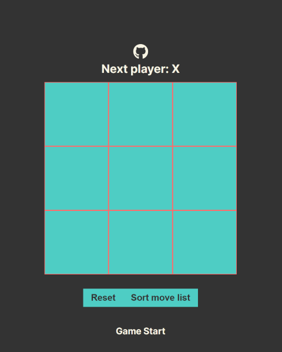

# React Tic Tac Toe

Tutorial for Tic Tac Toe from the official react documentation. Additionally, I finished additional challenges in the wrapping up portion and improved the CSS to make it appear lot nicer.



## Development

First, run the development server:

```bash
npm run dev
# or
yarn dev
# or
pnpm dev
```

Open [http://localhost:3000](http://localhost:3000) with your browser to see the result.

## Deployment

Deployed to vercel at
